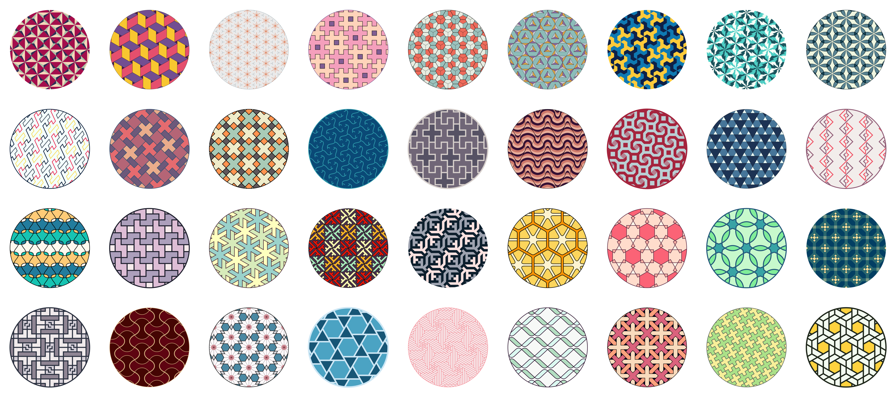

# Codecember 2019: Patterns

This is the fourth entry in a somewaht yearly thing I like to do where I work on a project every day during the month of December. This usually does not happen in December (previously: December 2016, January 2018, May 2019, and this time in August 2020).

## How to run it

It's static! which means you don't need a build process: you can just open `development.html` in your browser and see the stuff. There's a flag of `generateSvgs`. When it's `true` the patterns will be generated into svgs and you'll see a download button. When it's `false` the patterns will be generated using p5.js onto `canvas`es.

Each sketch lives in a `sketch<INDEX>.js` file. There's also `sketchXX.js`, which is used as a template. To create a new pattern you can run `./another`, which will make a copy of the template and change some stuff to make it work in `development.html`.

## How it works

The patterns are made using p5.js (which is really neat). As these things go I also built a little abstraction over vectors (`vector.js`, as well as the `v` and `vHex` functions in `utils.js`) to make things easier for me. These vector things are used in almost all of the patterns.

I used a relatively limited set of p5.js's capabilities (given these patterns are all static 2d sketches), which allowed me to make a compatible API which creates svgs instead of `canvas` sketches. This is in `p5svg.js` and that's how I'm able to save these sketches as svgs.
